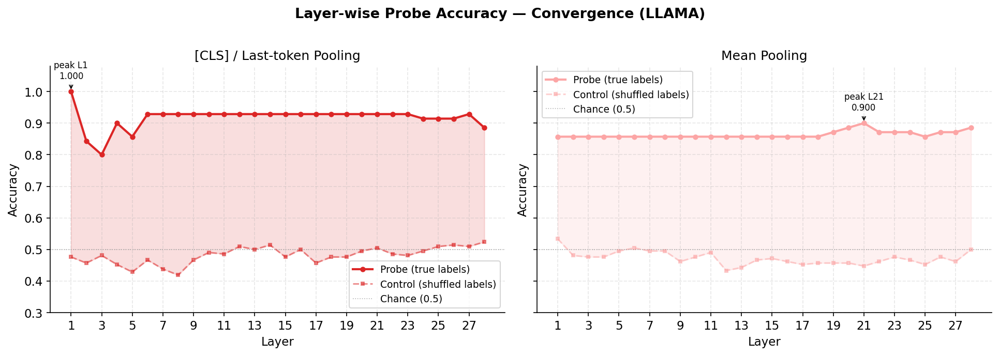
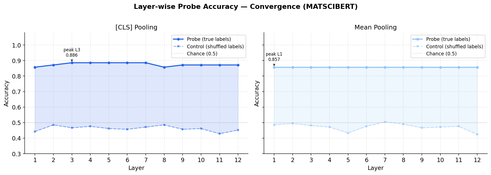

# Interpreting Materials Science Knowledge in LLMs Using Linear Probes

**Talia Kumar**  
MATH498 — Spring 2026

---

## Abstract

Do large language models understand the physics of materials, or do they merely recognize patterns correlated with physical outcomes? I investigate this question by applying linear probing to the hidden representations of a materials science-specific language model (MatSciBERT) and a general-purpose model (Llama-3.2-3B), probing for binary physical properties derived from LAMMPS atomic simulations. These two models serve as contrasting test cases: one trained densely on domain literature, one trained on orders of magnitude more general text, together allowing me to ask whether high probe accuracy reflects genuine physical encoding or surface-level lexical recognition. 
Large language models trained and/or pretrained on scientific text have been used increasingly for specialized work in materials science, where performing large-scale atomistic simulations can be practically impossible without an HPC cluster, or perhaps now, an LLM.¹ Yet strong benchmark performance does not establish that a model has formed a meaningful internal representation of the physics involved. I constructed a dataset of 125 text descriptions of atomic configurations derived from LAMMPS simulations, each labeled with one of two binary physical properties. I trained logistic regression probes on layer-wise embeddings of both models and report selectivity scores to distinguish encoded knowledge from task-learning artifacts. The primary finding is that high probe accuracy in both models is likely driven by lexical surface cues, outcome-determining phrases present verbatim in the text, rather than by deep physical encoding. A secondary finding is that Llama-3.2-3B achieves higher selectivity than MatSciBERT across most layers on both tasks, suggesting that general pretraining scale matters more than domain-specific corpus selection for representational quality.

---

## 1. Introduction
The application of large language models to materials science has accelerated rapidly, with domain-specific models such as MatSciBERT and LLaMat achieving strong performance on tasks including property prediction and information extraction. Yet a fundamental question remains unresolved: do these models encode physical concepts in their internal representations, or do they achieve high performance through surface-level pattern matching on scientific text?

Currently, strong benchmark performance of an LLM does not necessarily mean that the given model have formed an actual, replicable understading/representation of the physics behind certain material structures and experiments/simulations. A model can achieve high accuracy on a materials question, answering the given task by using the known pattern recognition tools from texts and provided corpa, rather than truly knowing the atomic structure of anything it is give. 

Whether LLMs genuinely encode physical concepts matters practically. If high probe accuracy on physically-labeled text reflects true internal encoding of concepts like convergence or stability, then LLMs are a meaningful tool for materials reasoning, and the representations they build could be trusted and extended. If, on the other hand, that accuracy reflects surface-level pattern matching on outcome phrases in the text, then LLM reliability in materials science is overstated across the board, regardless of whether a model is domain-specific or general-purpose. A model that identifies the phrase "satisfied both the energy and force tolerance criteria" is not the same as a model that understands what convergence means physically. Linear probing gives us a way to begin distinguishing these two cases: if physical concepts are encoded, they should be linearly separable in the model's hidden states; if they are not, high accuracy is better explained by lexical shortcuts.

To truly examine the substantibility of these models understandings, I used Linear Probes. A linear probe (Alain & Bengio, 2016) is a logistic regression classifier that is trained on frozen hidden states of a pretrained model. If a probe trained on a particular layer achieves high accuracy, that layer's representations make the given concept linearly separable, meaning the model has already done the work of separating the two classes internally, a simple classifier on top is enough to read it out.

This project applies linear probing to two binary physical properties drawn from computational materials science:

1. **Convergence**: whether a DFT calculation has converged.
2. **Structural Stability**: whether a given atomic configuration is energetically stable.

These properties are well-defined, simulation-grounded, and meaningful in materials research contexts. My central question is:

> *Do LLMs understand the physics of materials, or do they merely recognize patterns correlated with physical outcomes, as measured by linear probe selectivity on hidden representations?*

The answer has implications not only for materials science AI, but for the broader question of what domain-specific pretraining actually buys us at the representational level.

---

## 2. Related Work

### 2.1 Linear Probing as an Interpretability Method

Alain & Bengio (2016) introduced linear probes as a diagnostic tool for understanding what information is encoded at each layer of a neural network. Their key insight is that deeper layers may disregard low-level input details while simultaneously reorganizing the rest of the information into a form easier to read out. This means that probe accuracy can increase with depth even if the representation of information drifts further from the raw input. Training a logistic regression on layer \ell's activations measures how "explicitly" that layer represents a target concept. This project will adopt their selectivity metric, probe accuracy minus control probe accuracy on shuffled labels, to ensure what is being measured is what the model has encoded, not just what a probe can learn to predict.

### 2.2 Domain-Specific Language Models for Materials Science

MatSciBERT (Gupta et al., 2022) extends BERT-style pretraining to materials science literature and demonstrates strong gains on named entity recognition and relation extraction tasks in the domain. LLaMat similarly shows that domain-specific pretraining can outperform larger general-purpose models on materials tasks. These behavioral results motivate one hypothesis tested in this project: that domain-specific pretraining produces richer internal representations of physical concepts, which should appear as higher linear probe selectivity in a domain-trained model like MatSciBERT relative to a general-purpose one.
However, a second and more fundamental hypothesis underlies this work: that probe accuracy on physically-labeled text reflects genuine encoding of physical structure, rather than recognition of lexical markers correlated with physical outcomes. High probe accuracy is consistent with either story — a model could score well by encoding the physics, or by encoding the surface phrases that happen to co-occur with physical outcomes. This ambiguity is the central interpretive challenge of the project, and it is addressed in Section 5.

### 2.3 Surprising Strength of General-Purpose Models

Rubungo et al. (2023) presents LLM-Prop, which finds that a general-purpose T5 encoder with a simple linear projection can outperform domain-specific models and state-of-the-art graph neural networks on materials property prediction tasks including band gap and unit cell volume, which are specific and important measurements for atomic simulations. The authors argue this reflects the model's ability to access critical physical information, such as space group symmetry, from text descriptions. This finding sets up an important foil for this project: if a general-purpose model already captures the physical concepts we probe for, domain-specific pretraining may improve generation quality rather than conceptual encoding.

### 2.4 Token-Level Chemical Understanding

Zhang & Yang (PolyLLMem) visualize Llama 3 embeddings with UMAP and find that the model naturally clusters representations by physical properties prior to task-specific training. Token-level analysis further reveals that the model internalizes structural chemistry, recognizing aromatic rings and the effects of functional groups. This supports the possibility that general pretraining on scientific text may be enough to form meaningful physical representations.

### 2.5 Robustness Limitations

Tenney, Das, & Pavlick (2019) evaluate LLMs on materials science QA and property prediction, revealing sensitivity to prompt phrasing, degraded performance under distribution shift, and limited generalization. These results suggest behavioral performance is fragile, and motivate a probe-based approach that bypasses surface-level task performance in favor of internal representation quality.

### 2.6 Template: Domain-Specific vs. General Models via Probing

Hummel et al. (2026) provide a direct methodological template for this project's work. Using linear probing to compare domain-specific bioacoustic models against general-purpose audio models, they show that even embeddings dominated by irrelevant features (e.g., recording-specific IDs) can be filtered via linear probing to isolate domain-relevant features (e.g., ship acoustic signatures). Their systematic comparison framework directly informs our experimental design.

---

## 3. Methodology

### 3.1 Dataset Construction
I constructed a dataset of 125 text descriptions of atomic simulations, each labeled with one of two binary properties. Descriptions are generated from LAMMPS molecular dynamics and geometry optimization outputs, with each unique simulation paraphrased into five stylistically distinct descriptions to increase surface-level diversity while preserving the underlying physical content.

Convergence label: 
* Converged / Unconverged: whether a geometry optimization satisfied both energy and force tolerance criteria, or instead terminated early (e.g., hitting the maximum iteration limit or encountering line search failures)
* Stability label - Stable / Unstable: whether an NVT or NPT molecular dynamics trajectory remained thermodynamically well-behaved, based on temperature stabilization and absence of pathological behaviors such as dangerous neighbor list builds

Labels are assigned programmatically from simulation output rather than manually, grounding them in physical definitions. An example description:
"A geometry optimization using LJ/cut was run on 4 atoms under periodic boundary conditions. The relaxation satisfied both the energy and force tolerance criteria. Final energetics: potential energy = −70.4177 eV, total energy = −70.1850 eV."

#### 3.1.1 Helpful Background
Atomic level simulations model the behavior of large collections of atoms, specifically manipulating and/or recording how they interact and how they evolve over time or toward the materials equilibrium point. These interactions are known as the interatomic potential. A good optimization seeks a configuration where atomic forces are minimized; a standard molecular dynamic simulation involves relaxing a group of atoms under under a chosen thermodynamic ensemble, or given it certain volumetric parameters to see what happens under certain temperature conditions. Whether a given simulation has converged or produced a stable configuration are well-defined physical outcomes that I will use as probe targets.

* LJ/cut (Lennard-Jones potential) is a classical pairwise potential suitable for simple metals
* NequIP is a machine-learned interatomic potential based on equivariant neural networks, capable of capturing more complex bonding environments.
* NVT (constant **N**umber of atoms, **V**olume, and **T**emperature) and NPT (constant **N**umber of atoms, **P**ressure, and **T**emperature) are molecular dynamics runs
* DFT (Density Functional Theory) is a quantum mechanical method for computing the structure of materials. It works by iteratively solving for the electron density through a procedure called the Self-Consistent Field (SCF) cycle, which repeats until the solution stops changing beyond a specified threshold. Whether the SCF cycle reaches that threshold, aka convergence, is one of the two probe targets.

### 3.2 Models
#### MatSciBERT (BERT-style encoder):
* Architecture: 12 transformer layers, hidden size 768, 110M parameters — a direct extension of BERT-base.
* * Uses bidirectional self-attention (each token attends to all others simultaneously), so it sees the full context in every layer.
* Produces a [CLS] token as its sequence-level representation.
* Pretrained on ~2.4M materials science paper abstracts scraped from Elsevier, SpringerNature, and related sources, on top of the SciBERT checkpoint (Beltagy et al., 2019).
* You extract embeddings from all 12 layers for both [CLS] and mean-pooled tokens.

#### Llama-3.2-3B (decoder-only transformer):

* Architecture: 28 transformer layers, hidden size 3072, ~3B parameters.
* Uses causal (left-to-right) self-attention — each token only attends to prior tokens, so representations are built up auto-regressively. This is a key architectural difference from MatSciBERT worth mentioning.
* No [CLS] token; you use the last non-padding token as the sequence summary, plus mean pooling.
* Pretrained on a large general-purpose multilingual corpus (Meta, 2024) — orders of magnitude more text than MatSciBERT.
* Uses Grouped Query Attention (GQA) and RoPE (Rotary Position Embeddings), which differ from BERT's absolute positional encodings.

### 3.3 Probe Training

For each layer \ell \in \{1, ..., 12\} and each model, I trained a logistic regression probe on the extracted embeddings. The data will be split by unique simulation, ensuring that paraphrases of the same simulation are never split across sets. The probe is intentionally simple, L2-regularized logistic regression, because a more powerful classifier could learn to predict the label from any weak statistical regularity in the activations, which would say more about the probe's capacity rather than the model's representations.
I trained a control probe on randomly shuffled labels. This establishes how much accuracy a probe can achieve, independent of the target concept. Selectivity is then defined as:
\text{Selectivity}(\ell) = \text{Acc}_{\text{probe}}(\ell) - \text{Acc}_{\text{control}}(\ell)
A layer with positive selectivity encodes the target concept in a way that goes beyond what a probe could pick up by chance; a layer near zero selectivity does not, regardless of its raw accuracy.

### 3.4 Evaluation

I report the following:

* Layer-wise probe accuracy for both models on both tasks (convergence, stability)* 
* Selectivity curves across layers for both models
* Peak selectivity layer; which layer most explicitly encodes each concept
* Model comparison: which model achieves highest peak selectivity, and whether domain-specific pretraining or general scale better predicts representational quality
* Surface-form analysis: whether layer-wise probe accuracy patterns are consistent with lexical marker detection (flat accuracy from layer 1, spike at the first layer in decoder models) or require deeper representational processing, used to evaluate whether high accuracy reflects physical understanding or pattern matching on outcome phrases
---

## 4. Experiments and Preliminary Results

### 4.1 Dataset Status

The final dataset contains 125 text descriptions derived from 25 unique simulations, with 5 distinct paraphrases per simulation. Of these, 70 examples across 14 simulations are labeled for convergence (45 Converged, 25 Unconverged) and 55 examples across 11 simulations are labeled for stability (35 Stable, 20 Unstable). Simulations span three interatomic potentials- LJ/cut, EAM, and NequIP, and three run types: relaxation, NVT molecular dynamics, and NPT molecular dynamics. Labels are assigned from simulation output, grounding them in well-defined physical criteria rather than manual annotation.
This dataset is smaller than the 300 examples originally proposed. With 14 and 11 unique simulations respectively, the effective independent sample size is modest. All results should be interpreted with this in mind; the patterns we observe are consistent enough to be suggestive, but would benefit from replication on a larger dataset.

Table 1 shows a sample of descriptions from the current dataset.

| ID | Task | Label | Potential | Example Text (truncated) |
|----|------|-------|-----------|--------------------------|
| lammps_conv_lj_0 | Convergence | Converged | LJ/cut | "A geometry optimization using LJ/cut was run on 4 atoms... The relaxation satisfied both the energy and force tolerance criteria." |
| lammps_relax_maxiter_lj_0 | Convergence | Unconverged | LJ/cut | "A geometry optimization using LJ/cut was run on 4 atoms... The relaxation terminated after reaching the maximum iteration limit." |
| lammps_relax_linesearch_lj_0 | Convergence | Unconverged | LJ/cut | "A geometry optimization using LJ/cut was run on 4 atoms... The relaxation satisfied both the energy and force tolerance criteria." |
| lammps_lj_low_0 | Stability | Stable | LJ/cut | "A constant-volume, constant-temperature (100.0 K) MD simulation... the configuration remained thermodynamically stable." |
| lammps_lj_high_0 | Stability | Unstable | LJ/cut | "NVT dynamics at 2000.0 K were applied... the system exhibited signs of thermal instability." |
| lammps_nequip_npt_high_0 | Stability | Unstable | NequIP | "...the system exhibited signs of mechanical failure or instability under high pressure. Dangerous neighbor list builds were detected." |

*Table 1: Representative dataset examples across tasks, labels, and potentials.*

### 4.2 Preliminary Embedding Extraction

I extracted layer-wise embeddings from two pretrained models:

* MatSciBERT (Gupta et al., 2022): a BERT-style encoder with 12 transformer layers and hidden size 768, pretrained on materials science literature. I extracted the [CLS] token embedding and mean-pooled token embeddings from each of the 12 layers.
* Llama-3.2-3B (Meta, 2024): a decoder-only transformer with 28 layers and hidden size 3072, pretrained on a large general-purpose corpus. For decoder models there is no [CLS] token; I use the last non-padding token as the summary representation, and additionally extract mean-pooled embeddings across all non-padding tokens.

Extraction was performed on CPU for MatSciBERT and on an NVIDIA L40S GPU (Wendian HPC cluster) for Llama. For each example, embeddings from all layers are saved as numpy arrays of shape (n_examples, n_layers, hidden_size).

### 4.3 Probe Training and Evaluation Protocol

For each layer of each model, I trained an L2-regularized logistic regression probe using leave-one-simulation-out (LOSO) cross-validation. This ensures that all five paraphrases of the same underlying simulation are always held out together, preventing the probe from benefiting from surface similarity between training and test text. Prior to fitting, embeddings are standardized and reduced to 32 principal components via PCA (fit on the training split only). This dimensionality was chosen to maintain a favorable sample-to-feature ratio given the small training set, while retaining the dominant structure of the representation space. The implicit assumption is that if a model encodes physical concepts like convergence or stability, that signal should appear in high-variance directions, an assumption acknowledged in Section 5.4.
Selectivity at layer \ell is defined as:
\text{Selectivity}(\ell) = \text{Acc}_{\text{probe}}(\ell) - \text{Acc}_{\text{control}}(\ell)
A layer with positive selectivity encodes the target concept beyond what the probe could recover by chance.

### 4.4 Results: Convergence Task
MatSciBERT achieves remarkably flat probe accuracy across all 12 layers, ranging from 0.857 to 0.886, with selectivity consistently between +0.37 and +0.44. The [CLS] embedding peaks at layer 11 (selectivity +0.443) while mean pooling peaks at layer 12 (+0.433). The absence of any depth-dependent trend, the probe does equally well at layer 1 as at layer 12, suggests that convergence information is encoded from the very first transformer layer and is not progressively refined at deeper layers.
Llama-3.2-3B shows a sharply different pattern on the [CLS]/last-token representation. Layer 1 achieves perfect probe accuracy (1.000, selectivity +0.524), which immediately drops to approximately 0.843 at layer 2, then recovers and stabilizes around 0.929 for layers 6 through 27 before declining slightly at layer 28 (0.886, selectivity +0.362). Mean pooling is flat at 0.857 through most layers, with a very slight rise in layers 19–21, peaking at layer 21 (selectivity +0.452). The dramatic layer-1 spike in last-token representations is notable and discussed in Section 5.
Cross-model comparison: Llama achieves higher probe accuracy and selectivity than MatSciBERT across most of the network depth on the convergence task, particularly in the [CLS]/last-token representation. Both models' control probes hover near 0.45–0.52, consistent with chance performance on the 64%/36% class-imbalanced dataset, confirming the selectivity measure is functioning correctly.

### 4.5 Results: Stability Task

MatSciBERT shows stronger and more varied layer-wise behavior on the stability task than on convergence. [CLS] probe accuracy peaks at 1.000 at layer 3 (selectivity +0.479), then stabilizes around 0.945–0.964 for layers 4–12. Mean pooling peaks earlier at layer 2 (probe=0.982, selectivity +0.436) then gradually declines. The early peak at layer 3 is the most structurally interesting result from MatSciBERT, suggesting that stability information is particularly well-encoded in lower-middle layers of the encoder.

Llama-3.2-3B achieves substantially higher overall performance on stability. [CLS]/last-token probe accuracy reaches 1.000 at layers 4–8 and again at layers 27–28, with peak selectivity of +0.545 at layer 9. The selectivity curve remains above +0.45 for most of the network, indicating that stability information is robustly encoded at every depth. Mean pooling shows a striking late-layer pattern: accuracy stays around 0.909 through layers 1–14, then jumps to 1.000 at layer 15 and remains there through layer 28 — a sharp phase transition in representational quality in the second half of the network.
Cross-model comparison: Llama outperforms MatSciBERT on stability by a larger margin than on convergence, both in raw probe accuracy and in selectivity. The selectivity gap between models is most visible in the stability task plots, where Llama's curve sits consistently ~0.05–0.10 above MatSciBERT across normalized depth.

---

## 5. Discussion and Conclusions

### 5.1 Summary of Findings

This project applied linear probing to two pretrained language models, a domain-specific materials science encoder (MatSciBERT) and a general-purpose decoder (Llama-3.2-3B), on two binary physical classification tasks derived from LAMMPS atomistic simulations. The primary finding, which bears directly on the central research question, is that high probe accuracy in both models is likely explained by lexical surface cues rather than genuine physical concept encoding. The secondary finding is that Llama-3.2-3B outperforms MatSciBERT across most layers on both tasks, suggesting that general pretraining scale drives representational quality more than domain-specific corpus selection. Neither finding was the expected outcome.

### 5.2 Surface Form vs. Physical Understanding

A critical limitation of both models' high probe accuracy is that convergence and stability labels are correlated with highly distinctive surface phrases in the text descriptions. Converged simulations contain phrases like "satisfied both the energy and force tolerance criteria," while unconverged ones contain "terminated after reaching the maximum iteration limit." Stable systems are described as having "remained thermodynamically stable," while unstable ones "exhibited signs of thermal instability." These phrases appear verbatim across paraphrases, meaning a probe, or the model, could achieve high accuracy by identifying these lexical markers rather than by encoding any deeper physical understanding.
The flat layer-wise probe accuracy on the convergence task is a concrete instance of the phenomenon the research question was designed to investigate. If the signal is lexical, it should be present from layer 1 and require no further processing, which is precisely what we observe in both models on convergence. The layer-1 spike in Llama's last-token representation further supports this interpretation: the last token attends to the entire sequence and may be capturing the outcome phrase directly at the earliest layer.
The stability task's more varied layer-wise pattern, particularly MatSciBERT's layer-3 peak and Llama's mean-pooling phase transition at layer 15, is harder to explain by surface form alone, and may reflect some genuine structural encoding. However, with only 11 unique simulations for this task, these patterns cannot be interpreted with confidence.
This is the central answer to the research question as posed: the evidence is more consistent with pattern recognition on outcome-correlated phrases than with physical understanding encoded in the representations. This does not foreclose the possibility that LLMs encode some physical concepts,  it means that this experimental design, with its outcome phrases present in the text, cannot distinguish the two cases. Future work that deliberately obscures outcome phrases is needed to resolve the ambiguity.

### 5.3 Limitations

The primary limitation of this study is dataset size. With 14 and 11 unique simulations for convergence and stability respectively, the LOSO cross-validation folds are small and variance in fold-level accuracy is high. The PCA reduction to 32 components was necessary to make probing tractable but may discard relevant variance in the embedding space. Additionally, comparing a 12-layer encoder to a 28-layer decoder introduces architectural confounds beyond domain specificity, the models differ in size, training data, training objective, and positional encoding scheme, making it difficult to attribute differences in probe accuracy to any single factor. Most importantly, the presence of outcome-determining phrases in the text means that high probe accuracy cannot be taken as evidence of physical understanding without a follow-up experiment that removes those phrases.

### 5.4 Conclusions and Future Work

This project demonstrates that linear probing is a viable interpretability tool for evaluating physical concept encoding in language models, and produces two empirical results: first, that high probe accuracy on physically-labeled simulation text is likely driven by lexical surface cues rather than deep physical encoding; and second, that general-purpose scale outperforms domain-specific pretraining on the representational quality metrics studied here. The more important of these is the first — it reframes what it would mean for an LLM to "understand" materials physics, and sets a concrete methodological bar for future work to clear.
Future work should: expand the dataset to at least 300 examples across diverse simulation conditions to reduce variance; include a matched-size comparison model (e.g., a general-purpose BERT-base) to control for architecture; and most critically, design text descriptions that deliberately obscure outcome phrases, replacing "satisfied both the energy and force tolerance criteria" with numerical energy and force values only, to test whether probe accuracy survives the removal of lexical shortcuts. If it does, that would be meaningful evidence of physical understanding. If it does not, the null result would be definitive.

---

## Contributions

| Contributor | Role |
|-------------|------|
| Talia Kumar | All aspects: research question, dataset generation, modeling, analysis, writing |

---

## Footnotes:
¹ Periodic Labs (periodic.com) is a notable recent example: a startup founded in 2025 by former OpenAI VP Liam Fedus and Google DeepMind materials scientist Ekin Dogus Cubuk, aiming to combine frontier LLMs with autonomous robotic laboratories to accelerate materials discovery.

## References

Alain, Guillaume, and Yoshua Bengio. "Understanding intermediate layers using linear classifier probes." *arXiv preprint arXiv:1610.01644* (2016).

Beltagy, Iz, Kyle Lo, and Arman Cohan. "SciBERT: A pretrained language model for scientific text." *arXiv preprint arXiv:1903.10676* (2019).

Gupta, Tanishq, et al. "MatSciBERT: A materials domain language model for text mining and information extraction." *npj Computational Materials* 8 (2022): 1–11.

Hummel, [first name], et al. "Linear probing for domain-specific feature isolation in pretrained audio models." [venue] (2026). *(full citation to be completed)*

Rubungo, Andre Niyongabo, et al. "LLM-Prop: Predicting physical and electronic properties of crystalline solids from their text descriptions." *arXiv preprint arXiv:2310.05512* (2023).

Tang, Yingheng, et al. "MatterChat: A multi-modal LLM for material science." *arXiv preprint arXiv:2502.13107* (2025).

Tenney, Ian, Dipanjan Das, and Ellie Pavlick. "BERT Rediscovers the Classical NLP Pipeline." *Proceedings of the 57th Annual Meeting of the Association for Computational Linguistics*, pp. 4593–4601 (2019).

Zhang, [first name], and Yang, [first name]. "PolyLLMem: Exploring whether LLMs internalize chemical understanding for polymer property prediction." *(full citation to be completed)*

---
